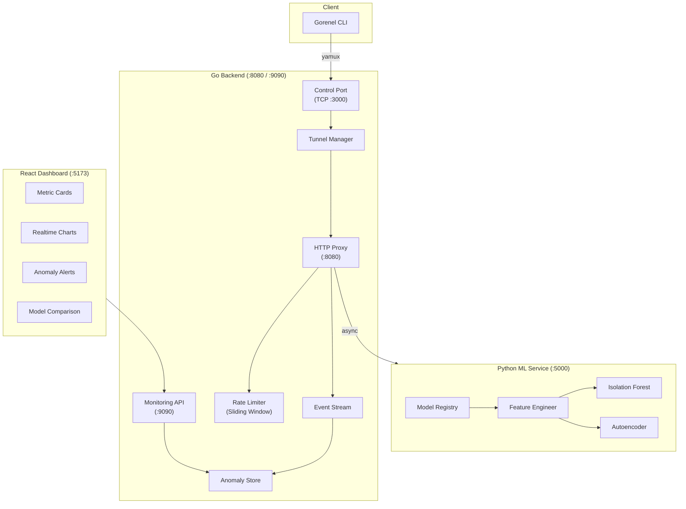

# 🔷 Gorenel — Fast, Open-Source Localhost Tunnels for Developers

[](https://opensource.org/licenses/MIT)
[](https://golang.org)
[](https://github.com/Bekican/gorenel)
[](https://github.com/Bekican/gorenel#self-hosting-mode)

> Expose your localhost with secure, stable public URLs, built-in edge policies, and optional real-time ML anomaly detection. An optimized, low-latency, and open-source alternative to ngrok and Cloudflare Tunnel.

---

## ⚖️ Why Gorenel? (Comparison)

| Feature | **Gorenel** 🔷 | **ngrok** 🟢 | **Cloudflare Tunnel** 🟠 |
| :--- | :---: | :---: | :---: |
| **Open-Source Engine** | **Yes** (100% Free) | No (Proprietary) | Partially Open |
| **Self-Hostable Backend** | **Yes** (Docker Compose) | No | No |
| **Reserved URLs (Free)** | **Yes** (First 1,000 users) | Limited / Paid | Yes |
| **Edge Access Policies** | **Yes** (IP Allowlist, Auth) | Paid Only | Yes |
| **Real-time Traffic Inspector** | **Yes** (Web Sniffer) | Yes | Limited |
| **Built-in Anomaly Detection** | **Yes** (Streaming Forest) | No | No |
| **Low-Latency TR/EU Nodes** | **Yes** (Optimized) | Variable | Good |

---


## 🏗️ Architecture



## ⚡ Quick Start

### Prerequisites
- **Go** 1.21+
- **Python** 3.10+ (with pip)
- **Node.js** 18+

### 1. Start the Go Server
```bash
cd gorenel
go run cmd/server/main.go
```

### 2. Start the ML Service
```bash
cd services/ml
pip install -r requirements.txt
python app.py
```

### 3. Start the Dashboard
```bash
cd web-dashboard
npm install
npm run dev
```

### 4. Connect a Client
```bash
go run cmd/client/main.go connect --port 3001 --type http
```

## 🧠 Dual-Model Anomaly Detection

| Feature | Isolation Forest | Autoencoder |
|---------|-----------------|-------------|
| **Type** | Tree-based | Neural Network |
| **Approach** | Isolates outliers via random partitioning | Measures reconstruction error |
| **Speed** | ~1ms inference | ~5ms inference |
| **Strengths** | Point anomalies, small datasets | Complex patterns, temporal drift |

Both models run in parallel. The consensus engine flags anomalies when **any** model detects an issue, giving maximum coverage.

## 📡 API Endpoints

| Endpoint | Method | Description |
|----------|--------|-------------|
| `/health` | GET | Server health check |
| `/metrics` | GET | System metrics (tunnels, connections, bandwidth) |
| `/analytics` | GET | Real-time analytics snapshot |
| `/api/tunnels` | GET | List active tunnels |
| `/api/anomalies` | GET | Recent anomaly detections |
| `/api/ml/stats` | GET | ML model statistics |
| `/api/login` | POST | User login |
| `/api/register` | POST | User registration |
| `/api/me` | GET | Current user info (JWT required) |

### ML Service API (`:5000`)

| Endpoint | Method | Description |
|----------|--------|-------------|
| `/health` | GET | ML service health |
| `/predict` | POST | Single-model prediction |
| `/predict/compare` | POST | Dual-model comparison |
| `/train` | POST | Trigger model training |
| `/stats` | GET | Model statistics |

## 🛡️ Simple Edge Access Policies

Secure your local application directly at our global edge before traffic reaches your machine. Zero code changes required:

### 1. Basic Password Protection
Password protect your public URL. Anyone attempting to access your tunnel will be prompted for credentials:
```bash
# Using the HTTP shortcut command:
gorenel http 3000 --auth "admin:supersecretpassword"
```

### 2. IP Allow-listing
Restict access to your public URL only to authorized clients or specific development networks:
```bash
# Allow only a single remote client IP:
gorenel http 3000 --ip-whitelist "203.0.113.50"

# Allow multiple IPs or subnets:
gorenel http 3000 --ip-whitelist "203.0.113.50" --ip-whitelist "198.51.100.0/24"
```

### 3. Smart CORS Handling
Enable automatic Cross-Origin Resource Sharing (CORS) resolution at the edge proxy layer to resolve local development integration issues instantly:
```bash
gorenel http 3000 --cors
```

## 🛡️ Production Hardening (Phase 9)

- ✅ **Structured Logging**: All `log.Printf` replaced with `zap` — JSON output, typed fields, log levels
- ✅ **Graceful Shutdown**: `SIGINT`/`SIGTERM` handlers for clean resource cleanup
- ✅ **Panic Recovery**: Middleware catches panics and returns 500 instead of crashing
- ✅ **Error Boundaries**: React ErrorBoundary components prevent dashboard white-screens

## 🧪 Testing

```bash
# Run all Go tests with race detector
go test -v -race ./...

# Run ML load test
python services/ml/load_tester.py --requests 1000 --concurrency 10
```

## 📁 Project Structure

```
gorenel/
├── cmd/
│   ├── server/main.go          # Server entry point
│   └── client/cmd/start.go     # CLI client
├── internal/
│   ├── server/                  # Core proxy, tunnels, analytics
│   ├── middleware/              # Auth, rate-limit, panic recovery
│   ├── ml/                      # ML client (Go → Python bridge)
│   └── protocol/               # Wire protocol constants
├── services/
│   └── ml/                      # Python ML service
│       ├── app.py               # Flask API
│       ├── model_registry.py    # Dual-model management
│       └── feature_engineering.py
├── web-dashboard/               # React + Vite dashboard
│   └── src/
│       ├── components/          # UI components
│       └── api/client.ts        # API client
└── tests/                       # Stress & integration tests
```

## 🐳 Self-Hosting Mode

Run your own private Gorenel tunneling backend and relay server in less than 60 seconds:

```bash
docker compose -f docker-compose.self-hosted.yml up -d
```

Refer to the [docker-compose.self-hosted.yml](file:///c:/Users/Bekir%20Can/Desktop/advancedbackend/gorenel/docker-compose.self-hosted.yml) template for environment variable options and wildcard DNS setup.

## 📜 License

MIT — Built as an academic research & SaaS demo project.


## Client Command Standard

Use config-first flow:
```bash
go run cmd/client/main.go config set api_key YOUR_API_KEY
go run cmd/client/main.go connect --port 3001 --type http
```
