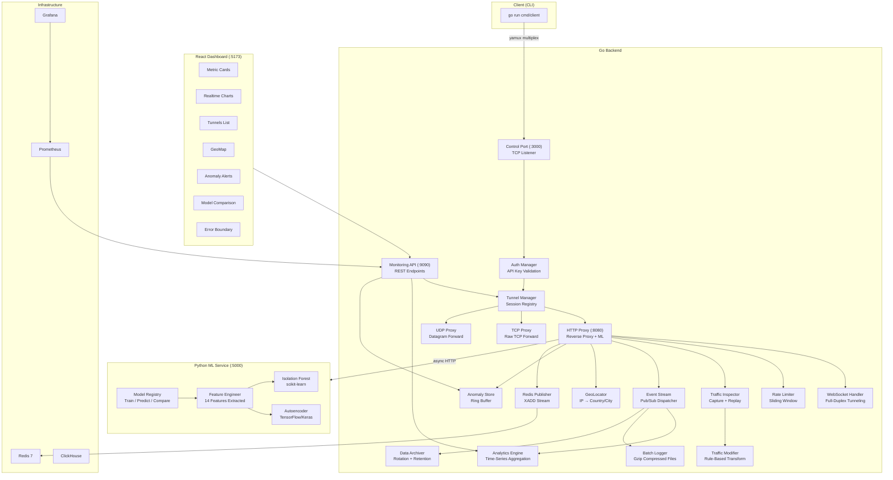
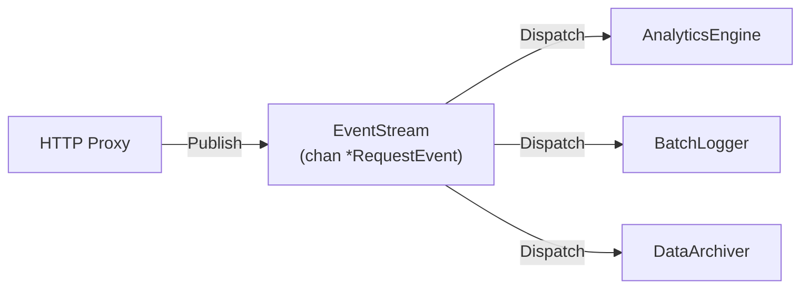
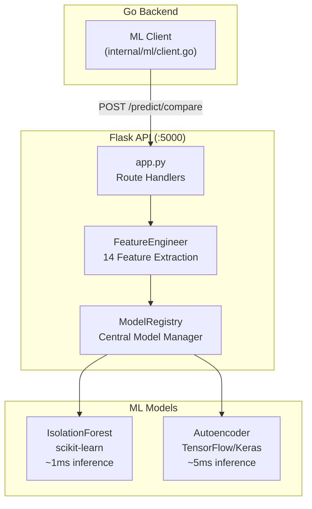

# Gorenel — Kapsamlı Teknik Rapor

> **Gorenel**, Go ile yazılmış bir akıllı reverse proxy / tunneling sistemidir. Gerçek zamanlı trafik analizi, makine öğrenmesi tabanlı çift-model anomali tespiti, event-driven mimari ve full-stack monitoring dashboard'u ile üretim kalitesinde bir altyapı çözümü sunar.

---

## İçindekiler

1. [Sistem Mimarisi](#1-sistem-mimarisi)
2. [Go Backend — Core Engine](#2-go-backend--core-engine)
3. [Ağ Protokolü ve Multiplexing](#3-ağ-protokolü-ve-multiplexing)
4. [Proxy Katmanı (HTTP / TCP / UDP / WebSocket)](#4-proxy-katmanı)
5. [Tunnel Yönetimi](#5-tunnel-yönetimi)
6. [Event-Driven Mimari](#6-event-driven-mimari)
7. [Real-time Analytics Engine](#7-real-time-analytics-engine)
8. [Traffic Inspection & Modification](#8-traffic-inspection--modification)
9. [IP Geolocation Servisi](#9-ip-geolocation-servisi)
10. [Veri Arşivleme ve Batch Logging](#10-veri-arşivleme-ve-batch-logging)
11. [Redis Pub/Sub Entegrasyonu](#11-redis-pubsub-entegrasyonu)
12. [Makine Öğrenmesi Servisi (Python)](#12-makine-öğrenmesi-servisi)
13. [Güvenlik ve Kimlik Doğrulama](#13-güvenlik-ve-kimlik-doğrulama)
14. [Rate Limiting (Sliding Window)](#14-rate-limiting)
15. [Error Handling Framework](#15-error-handling-framework)
16. [Structured Logging (zap)](#16-structured-logging)
17. [Production Hardening](#17-production-hardening)
18. [React Dashboard](#18-react-dashboard)
19. [DevOps ve Containerization](#19-devops-ve-containerization)
20. [Akademik Katkılar ve Araştırma Değeri](#20-akademik-katkılar)
21. [Kullanılan Teknolojiler](#21-kullanılan-teknolojiler)

---

## 1. Sistem Mimarisi



### Katmanlı Mimari

| Katman | Teknoloji | Sorumluluk |
|--------|-----------|------------|
| **Ağ (Network)** | Go `net`, yamux | TCP listener, multiplexed tunneling, bidirectional streaming |
| **Proxy** | Go `net/http`, custom handlers | HTTP/HTTPS reverse proxy, TCP/UDP forwarding, WebSocket upgrade |
| **İş Mantığı** | Go structs, goroutines | Event processing, analytics, rate limiting, traffic inspection |
| **ML** | Python Flask, scikit-learn, TensorFlow | Feature engineering, dual-model anomaly detection, model registry |
| **Sunum** | React, Vite, Recharts, Lucide | Real-time dashboard, metric cards, geo visualization |
| **Altyapı** | Docker, Helm, Prometheus, Grafana, Redis, ClickHouse | Container orchestration, metrics collection, data storage |

---

## 2. Go Backend — Core Engine

### Entry Point: `cmd/server/main.go`

Sunucu başlatma sırası (initialization chain):

```
1. Logger Init (zap)
2. TunnelManager oluştur
3. AuthManager oluştur
4. RateLimiter (60 req/min, sliding window)
5. TrafficInspector (son 100 request buffer)
6. EventStream (1000 event buffer)
7. AnalyticsEngine (24h window) → EventStream'e subscribe
8. BatchLogger (./logs/batches, 1000 event batch, 5min flush) → subscribe
9. DataArchiver (./logs/archives, 1h rotation, 30 gün retention) → subscribe
10. GeoLocator (cache enabled)
11. JWTService + UserRepo + AuthHandler
12. ML Client (http://localhost:5000)
13. HTTPProxy (tüm bileşenleri birleştir)
14. MonitoringServer (:9090)
15. TCP Control Listener (:3000)
16. Graceful shutdown signal handler
```

**Teknik önem:** Dependency Injection pattern kullanılarak tüm bileşenler `main()` içinde oluşturulup birbirine enjekte edilir. Bu, test edilebilirlik ve modülerlik sağlar.

### Goroutine Mimarisi

```
main goroutine (sinyal bekler)
├── HTTP Proxy goroutine (ListenAndServe)
├── Monitoring Server goroutine (ListenAndServe)
├── Control Port Accept loop goroutine
│   └── her bağlantı için → handleClient goroutine
│       ├── yamux session management
│       └── TCP/UDP proxy goroutines
├── EventStream dispatcher goroutine
├── BatchLogger periodicFlush goroutine
├── DataArchiver periodicMaintenance goroutine
└── AnalyticsEngine cleanup goroutine
```

---

## 3. Ağ Protokolü ve Multiplexing

**Dosya:** `internal/protocol/`

### Özel Wire Protocol

Gorenel, client-server iletişimi için kendi mesaj protokolünü tanımlar:

| Mesaj Tipi | Yön | Açıklama |
|------------|-----|----------|
| `REGISTER` | Client → Server | Yeni tunnel kaydı (API key, tunnel tipi, port, custom domain) |
| `REGISTERED` | Server → Client | Onay yanıtı (subdomain, full URL, public port) |
| `ERROR` | Server → Client | Hata bilgisi (code + message) |

### Yamux Multiplexing

```
Tek TCP bağlantısı üzerinden çoklu stream:

Client ←──── yamux ────→ Server
         ├── Stream #1 (HTTP request/response)
         ├── Stream #2 (WebSocket traffic)
         ├── Stream #3 (Another HTTP req)
         └── Stream #N (...)
```

**Neden yamux?**
- Tek bir TCP port'u üzerinden sınırsız sayıda eşzamanlı bağlantı
- Düşük overhead (~12 byte header per frame)
- Backpressure ve flow control desteği
- NAT/firewall arkasındaki client'lar için ideal

**Teknik detay:** `yamux.Server()` kullanılır çünkü server tarafı stream'leri **kabul eder**, client tarafı ise `yamux.Client()` ile stream'leri **açar**.

---

## 4. Proxy Katmanı

### HTTP Proxy (`http_proxy.go` — ~300 satır)

**Ana işlev:** Gelen HTTP isteklerini subdomain'e göre doğru tunnel'a yönlendirir.

```
İstek Akışı:
1. ServeHTTP() çağrılır
2. Client IP çıkarılır
3. Host header'dan subdomain/custom domain çözümlenir
4. Rate limiter kontrolü (→ 429 Too Many Requests)
5. TrafficModifier ile request manipülasyonu
6. TunnelManager'dan yamux session bulunur (→ 404 Not Found)
7. WebSocket upgrade kontrolü (varsa → HandleWebSocket)
8. Yeni yamux stream açılır
9. Request body intercept edilir (TrafficInspector için)
10. Request stream'e yazılır
11. Response okunur ve client'a kopyalanır
12. CapturedRequest kaydedilir (Inspector)
13. Tunnel istatistikleri güncellenir
14. Redis'e trafik verisi publish edilir
15. ML anomali analizi tetiklenir (async)
16. Event publish edilir (EventStream)
```

**Önemli teknik detaylar:**
- `ResponseCaptureWriter`: `http.ResponseWriter` sarmalayıcısı — status code ve body'yi yakalar
- `InterceptBody`: Request body'yi okuyup geri yazar (tee-reader pattern)
- ML analizi **asenkron** yapılır (`PredictCompareAsync`) — request latency'sini etkilemez

### TCP Proxy (`tcp_proxy.go`)

```go
// Bidirectional pipe:
go io.Copy(stream, conn)  // Internet → Yamux → Client
go io.Copy(conn, stream)  // Client → Yamux → Internet
```

- Ham TCP trafiği için port tahsisi yapar
- Her public port bir ayrı `net.Listener`
- Session kapanınca listener otomatik kapanır

### UDP Proxy (`udp_proxy.go`)

- `net.ListenUDP` ile datagram dinler
- Her remote address için ayrı yamux stream oluşturur
- Stream mapping: `map[string]net.Conn` (remote addr → stream)
- UDP'den TCP'ye (yamux) köprüleme sağlar

### WebSocket Handler (`websocket.go`)

```
1. HTTP Hijack ile raw TCP bağlantısını ele geçir
2. Yeni yamux stream aç
3. HTTP upgrade request'ini stream'e yaz
4. Buffered veriyi drain et
5. Bidirectional copy başlat (io.Copy)
6. İlk kapanan taraf diğerini de kapatır
```

**Atomic counter:** `WebSocketConnections` sayacı `sync/atomic` ile thread-safe olarak takip edilir.

---

## 5. Tunnel Yönetimi

**Dosya:** `tunnel_manager.go`

### TunnelInfo Yapısı

```go
type TunnelInfo struct {
    Session      *yamux.Session
    Subdomain    string
    CustomDomain string
    LocalPort    int
    FullURL      string
    CreatedAt    time.Time
    BytesIn      int64   // atomic
    BytesOut     int64   // atomic
    RequestCount int64   // atomic
}
```

### Özellikler

| Özellik | Açıklama |
|---------|----------|
| **Session Registry** | `sync.RWMutex` korumalı `map[string]*TunnelInfo` — O(1) lookup |
| **Custom Domain Mapping** | `customDomains map[string]string` — domain → subdomain çözümleme |
| **Port Allocation** | 10000-60000 aralığında rastgele port tahsisi (`crypto/rand`) |
| **Atomic Stats** | `sync/atomic` ile lock-free trafik istatistikleri |
| **Tunnel List API** | `GetAllTunnels()` — monitoring dashboard'u için snapshot |

---

## 6. Event-Driven Mimari

**Dosyalar:** `events.go`, `batch_logger.go`, `archival.go`

### Pub/Sub Pattern



### RequestEvent Yapısı

Her HTTP isteği için oluşturulan event:

```go
type RequestEvent struct {
    ID           string
    Subdomain    string
    Method       string
    Path         string
    StatusCode   int
    ResponseTime time.Duration
    BytesIn      int64
    BytesOut     int64
    ClientIP     string
    UserAgent    string
    GeoCountry   string
    GeoCity      string
    Timestamp    time.Time
    IsAnomaly    bool
    AnomalyScore float64
}
```

### EventConsumer Interface

```go
type EventConsumer interface {
    Name() string
    Consume(event *RequestEvent) error
}
```

Bu interface'i implement eden 3 consumer var:
1. **AnalyticsEngine** — gerçek zamanlı istatistik toplama
2. **BatchLogger** — batch halinde sıkıştırılmış dosyaya yazma
3. **DataArchiver** — uzun vadeli arşivleme

### Dispatcher Mekanizması

- Buffered channel (`chan *RequestEvent`, size=1000)
- Tek goroutine'da event'leri consumer'lara dağıtır
- Her consumer kendi goroutine'ında çalışır (paralel işleme)
- Error'lar `zap` ile structured olarak loglanır

---

## 7. Real-time Analytics Engine

**Dosya:** `analytics.go` (~466 satır)

### Veri Toplama

| Metrik | Tip | Açıklama |
|--------|-----|----------|
| `topPaths` | `map[string]int64` | En çok istek alan path'ler |
| `topCountries` | `map[string]int64` | Ülke bazlı trafik dağılımı |
| `topUserAgents` | `map[string]int64` | User agent istatistikleri |
| `statusCodes` | `map[int]int64` | HTTP status code dağılımı |
| `responseTimeSum` | `time.Duration` | Toplam yanıt süresi |
| `dataPoints` | `[]DataPoint` | Time-series veri noktaları |

### Time-Series Aggregation

**1 dakikalık bucket'lara** aggregation yapılır:

```go
type TimeSeriesBucket struct {
    Timestamp    time.Time
    Requests     int64
    AvgLatency   time.Duration
}
```

### Sliding Window

- Varsayılan window: **24 saat**
- Arka plan goroutine'u periyodik olarak eski veri noktalarını temizler
- Memory leak önlenir: sadece window içindeki veriler tutulur

### Analytics Snapshot

Dashboard'a gönderilen snapshot:

```go
type AnalyticsSnapshot struct {
    Timestamp       time.Time
    TotalRequests   int64
    AvgResponseTime time.Duration
    TopPaths        []RankItem
    TopCountries    []RankItem    // GeoMap için
    TopUserAgents   []RankItem
    StatusCodeDist  map[int]int64
    TimeSeries      []TimeSeriesBucket  // Grafik için
}
```

---

## 8. Traffic Inspection & Modification

### Traffic Inspector (`traffic_inspector.go`)

**Ring buffer** yapısıyla son N isteği saklar:

| Özellik | Açıklama |
|---------|----------|
| `Record()` | Yeni istek kaydeder, buffer dolunca en eskiyi siler |
| `GetHistory()` | Tüm kaydedilmiş istekleri döndürür |
| `GetByID()` | UUID ile spesifik istek bulma |
| `Replay()` | Geçmiş bir isteği yeniden gönderme (debugging için) |

**CapturedRequest** yapısı tüm HTTP detaylarını saklar: method, path, headers (req+resp), body (req+resp), status code, timing.

### Traffic Modifier (`traffic_modifier.go`)

**Rule-based request transformation:**

```go
type ModificationRule struct {
    ID            string            // Benzersiz kural ID'si
    PathPattern   string            // "/api/*" glob pattern
    AddHeaders    map[string]string // Eklenecek header'lar
    RemoveHeaders []string          // Silinecek header'lar
    ReplacePath   string            // Path değiştirme
}
```

- Glob-style path matching (`/api/*`)
- Thread-safe (`sync.RWMutex`)
- Runtime'da kural ekleme/silme API'si

---

## 9. IP Geolocation Servisi

**Dosya:** `geolocation.go`

### Özellikler

- **External API:** `ip-api.com` kullanarak IP → ülke/şehir/ISP çevirir
- **In-memory Cache:** Tekrarlayan IP'ler için O(1) cache (`sync.RWMutex` korumalı)
- **Rate Limiting:** API çağrıları arası minimum 4 saniye bekleme (ip-api.com free tier limiti)
- **Local IP Detection:** `127.0.0.1`, `::1`, `localhost` için API çağrısı yapılmaz

```go
type GeoLocation struct {
    Country     string
    CountryCode string
    City        string
    Region      string
    Latitude    float64
    Longitude   float64
    Timezone    string
    ISP         string
}
```

---

## 10. Veri Arşivleme ve Batch Logging

### Batch Logger (`batch_logger.go`)

| Parametre | Varsayılan | Açıklama |
|-----------|-----------|----------|
| `batchSize` | 1000 | Kaç event birikince dosyaya yazılır |
| `flushInterval` | 5 dakika | Periyodik flush süresi |
| `outputDir` | `./logs/batches` | Çıktı dizini |

- **Gzip sıkıştırma:** Her batch dosyası `.jsonl.gz` formatında
- **Atomic flush:** `sync.Mutex` ile korumalı
- **Periodic flush:** Buffer dolmasa bile 5 dakikada bir yazılır

### Data Archiver (`archival.go`)

| Parametre | Varsayılan | Açıklama |
|-----------|-----------|----------|
| `rotateInterval` | 1 saat | Dosya rotasyon süresi |
| `retentionDays` | 30 gün | Eski dosyaların saklanma süresi |
| `archiveDir` | `./logs/archives` | Arşiv dizini |

- **File rotation:** Saatlik otomatik dosya rotasyonu
- **Retention cleanup:** 30 günden eski dosyalar otomatik silinir
- **Streaming write:** Her event geldiğinde gzip stream'e yazılır (batch beklenmez)

---

## 11. Redis Pub/Sub Entegrasyonu

**Dosya:** `redis_publisher.go`

```go
type TrafficData struct {
    Method       string
    Path         string
    StatusCode   int
    ResponseTime int64
    RequestSize  int64
    ResponseSize int64
    ClientIP     string
    Timestamp    string
}
```

- **Redis Streams** kullanılır (`XADD` komutu)
- Stream adı: `traffic_stream`
- Her HTTP isteği sonrası **asenkron** olarak publish edilir
- Downstream consumer'lar (ClickHouse, Grafana) bu stream'den okur

---

## 12. Makine Öğrenmesi Servisi

### Mimari



### Feature Engineering (`feature_engineering.py`)

**14 özellik çıkarılır:**

| # | Feature | Kategori | Açıklama |
|---|---------|----------|----------|
| 1 | `hour` | Zaman | Saat (0-23) |
| 2 | `day_of_week` | Zaman | Haftanın günü (0-6) |
| 3 | `hour_sin` | Zaman | Sinüs dönüşümü (döngüsel encoding) |
| 4 | `hour_cos` | Zaman | Kosinüs dönüşümü |
| 5 | `method_encoded` | HTTP | GET=0, POST=1, PUT=2, DELETE=3, PATCH=4 |
| 6 | `path_length` | HTTP | URL path uzunluğu |
| 7 | `path_depth` | HTTP | URL derinliği (/ sayısı) |
| 8 | `has_query` | HTTP | Query string var mı? |
| 9 | `is_suspicious_path` | Güvenlik | SQL injection, path traversal pattern'leri |
| 10 | `response_time_log` | Performans | Log-transform yanıt süresi |
| 11 | `request_size_log` | Performans | Log-transform istek boyutu |
| 12 | `response_size_log` | Performans | Log-transform yanıt boyutu |
| 13 | `is_error` | HTTP | Status ≥ 400 |
| 14 | `is_server_error` | HTTP | Status ≥ 500 |

**RobustScaler** kullanılır (outlier'lara dayanıklı normalizasyon).

### Isolation Forest Modeli

```python
IsolationForest(
    contamination=0.1,    # %10 anomali oranı varsayımı
    n_estimators=100,     # 100 karar ağacı
    max_samples=256,      # Her ağaç için alt-örneklem
    n_jobs=-1,            # Tüm CPU çekirdekleri
    random_state=42       # Tekrarlanabilirlik
)
```

**Nasıl çalışır:**
1. Rastgele özellik seçimi
2. Rastgele bölme noktası belirleme
3. Anomaliler daha az bölme ile izole edilir (kısa path)
4. `score_samples()` → normalize edilerek [0,1] anomali olasılığı

**Avantajları:** Hızlı (~1ms), eğitimsiz veriyle çalışabilir, yüksek boyutlu veri desteği

### Autoencoder Modeli

```
Mimari:
Input(14) → Dense(32, ReLU) → Dense(16, ReLU) → Dense(8, ReLU)
         → Dense(16, ReLU) → Dense(32, ReLU) → Output(14, Linear)
```

**Nasıl çalışır:**
1. Normal trafiği sıkıştırıp geri açmayı öğrenir
2. Reconstruction error (MSE) hesaplanır
3. Threshold = training verisinin %95 percentile'ı
4. MSE > threshold → anomali

**Avantajları:** Karmaşık pattern'leri yakalar, temporal drift'e uyum sağlar

### Consensus Engine (Çift-Model Karar Mekanizması)

```python
# predict_compare() sonucu:
{
    "models": {
        "isolation_forest": {"is_anomaly": true, "anomaly_score": 0.87},
        "autoencoder": {"is_anomaly": false, "anomaly_score": 0.42}
    },
    "consensus": {
        "any_anomaly": true,       # Herhangi bir model anomali dedi mi?
        "all_agree": false,        # Tüm modeller aynı fikirde mi?
        "flagged_by": ["isolation_forest"],
        "models_compared": 2
    }
}
```

**Strateji:** `any_anomaly = true` → maksimum kapsama (false negative minimize).

### Go ↔ Python Köprüsü (`internal/ml/client.go`)

- **Senkron:** `Predict()`, `PredictCompare()` — context timeout (5s)
- **Asenkron:** `PredictAsync()`, `PredictCompareAsync()` — callback pattern + goroutine
- **Health Check:** `/health` endpoint'i ile servis durumu kontrolü
- HTTP Proxy'de ML analizi **asenkron** yapılır → request latency'si etkilenmez

---

## 13. Güvenlik ve Kimlik Doğrulama

### API Key Authentication (`auth.go`)

```go
type APIKey struct {
    Key       string
    UserID    string
    CreatedAt time.Time
    UsageCount int64
    Active    bool
}
```

- Her client `REGISTER` mesajında API key gönderir
- Key doğrulaması başarısız → 401 Unauthorized
- Kullanım sayısı `atomic` olarak artırılır

### JWT Token Servisi (`pkg/auth/jwt_service.go`)

| Parametre | Değer |
|-----------|-------|
| Algorithm | HS256 (HMAC-SHA256) |
| Expiry | 24 saat |
| Issuer | `gorenel.io` |
| Claims | UserID, Email, RegisteredClaims |

```go
// Token oluşturma
token := jwt.NewWithClaims(jwt.SigningMethodHS256, claims)
return token.SignedString(s.secretKey)

// Token doğrulama
jwt.ParseWithClaims(tokenString, &Claims{}, keyFunc)
```

### OAuth Desteği (`pkg/auth/oauth_service.go`)

OAuth 2.0 flow interface'i tanımlıdır:

```go
type OAuthProvider interface {
    GetAuthURL(state string) string
    GetUserProfile(code string) (*UserProfile, error)
}
```

### Middleware Stack

```
Request → CORS → RateLimit → Auth(JWT) → ErrorWrapper → Handler
```

- **RequireAuth:** JWT token kontrolü (`Authorization: Bearer <token>`)
- **RateLimitMiddleware:** Her endpoint'e rate limiting uygular
- **ErrorWrapper:** `AppError` → JSON response dönüşümü
- **CORS:** Cross-origin isteklere izin verir

---

## 14. Rate Limiting

### Sliding Window Algoritması

- **Window:** 1 dakika
- **Limit:** 60 request/dakika (per subdomain/IP)
- **Thread-safe:** `sync.Mutex` korumalı

```
Timeline:
|------- 1 min window -------|
|  req  req  req  ...  req   | → 60'dan fazla mı? → 429
```

Her istekte window kaydırılır, eski kayıtlar silinir. Burst traffic'e karşı koruma sağlar.

---

## 15. Error Handling Framework

**Dosya:** `pkg/errors/`

### Tipli Hata Sistemi

```go
type AppError struct {
    Type        ErrorType         // VALIDATION, NOT_FOUND, UNAUTHORIZED, INTERNAL, CONFLICT
    Code        int               // HTTP status code
    Message     string            // Kullanıcı-dostu mesaj
    FieldErrors map[string]string // Alan bazlı validation hataları
    Err         error             // Sarmalanmış orijinal hata
    stack       string            // Stack trace
}
```

### Stack Trace Yakalama

```go
func captureStack() string {
    for i := 3; i < 15; i++ {
        _, file, line, ok := runtime.Caller(i)
        // ...
    }
}
```

- `runtime.Caller()` ile çağrı yığını yakalanır
- Path'ler kısaltılır (`/gorenel/` prefix'inden sonrası)
- Debugging için `AppError.StackTrace()` metodu

### Factory Fonksiyonları

```go
errors.NotFound("Kaynak bulunamadı", cause)
errors.BadRequest("Geçersiz parametre", cause)
errors.Internal(cause)
errors.ValidationError("Doğrulama hatası", fields)
errors.Unauthorized("Oturum gerekli")
```

### ErrorWrapper Middleware

```go
// Handler'ın döndürdüğü error'u JSON'a çevirir:
{
    "type": "VALIDATION_ERROR",
    "code": 422,
    "message": "Doğrulama hatası",
    "fields": {"email": "Geçersiz format"}
}
```

---

## 16. Structured Logging

### Migration: `log.Printf` → `zap`

**9 dosyada ~40+ çağrı** migrate edildi:

| Dosya | Değişiklik |
|-------|-----------|
| `main.go` | 25+ log çağrısı → `zapLogger.Info/Error/Warn/Fatal` |
| `http_proxy.go` | 12 çağrı → `p.logger` |
| `websocket.go` | 6 çağrı → `p.logger` |
| `tunnel_manager.go` | 4 çağrı → `tm.logger` |
| `archival.go` | 5 çağrı → `da.logger` |
| `batch_logger.go` | 2 çağrı → `bl.logger` |
| `events.go` | 1 çağrı → `es.logger` |
| `tcp_proxy.go` | 3 çağrı → `p.logger` |
| `udp_proxy.go` | 1 çağrı → `p.logger` |
| `monitoring.go` | 1 çağrı → inline logger |

### Örnek: Önceki vs Sonraki

```diff
- log.Printf("HTTP Proxy listening on %s", port)
+ p.logger.Info("HTTP Proxy listening", zap.String("port", port))

- log.Printf("Error: %v", err)
+ p.logger.Error("Request failed", zap.Error(err), zap.String("path", r.URL.Path))
```

**Neden zap?**
- JSON çıktısı → log aggregation (ELK, Datadog) uyumlu
- Typed fields → arama ve filtreleme
- Zero-allocation logging → yüksek performans
- Log levelları (Debug/Info/Warn/Error/Fatal)

---

## 17. Production Hardening

### Graceful Shutdown

```go
ctx, stop := signal.NotifyContext(context.Background(), os.Interrupt, syscall.SIGTERM)
defer stop()

go acceptLoop(ctx, listener)  // goroutine'da çalışır

<-ctx.Done()                  // sinyal bekle
listener.Close()              // accept durdur
// defer'ler çalışır: EventStream, BatchLogger, Archiver temizlenir
```

### Panic Recovery Middleware

```go
func PanicRecovery(logger *zap.Logger) func(http.Handler) http.Handler {
    return func(next http.Handler) http.Handler {
        return http.HandlerFunc(func(w http.ResponseWriter, r *http.Request) {
            defer func() {
                if rec := recover(); rec != nil {
                    stack := string(debug.Stack())
                    logger.Error("PANIC RECOVERED",
                        zap.Any("panic", rec),
                        zap.String("stack_trace", stack),
                    )
                    http.Error(w, "Internal Server Error", 500)
                }
            }()
            next.ServeHTTP(w, r)
        })
    }
}
```

**Neden kritik?** Tek bir handler'da panic olursa tüm Go process çöker. Bu middleware sayesinde sadece o request 500 döndürür, sunucu çalışmaya devam eder.

### React Error Boundary

```tsx
class ErrorBoundary extends Component<Props, State> {
    static getDerivedStateFromError(error: Error) → { hasError: true }
    componentDidCatch(error, errorInfo) → console.error + Sentry
}
```

- 3 bağımsız ErrorBoundary: Charts, Tunnels/Geo, Security/ML
- Bir bileşen patlarsa sadece kendi bölümü "Tekrar Dene" butonu gösterir

---

## 18. React Dashboard

### Bileşen Haritası

| Bileşen | Dosya | Açıklama |
|---------|-------|----------|
| `App` | `App.tsx` | Ana uygulama, state yönetimi, 5s polling |
| `LoginPage` | `LoginPage.tsx` | JWT login formu |
| `MetricCard` | `MetricCard.tsx` | Metric kartları (tunnel, request, connection, latency) |
| `RealtimeChart` | `RealtimeChart.tsx` | Recharts ile canlı grafik (request rate, latency) |
| `TunnelsList` | `TunnelsList.tsx` | Aktif tunnel'ların listesi |
| `GeoMap` | `GeoMap.tsx` | Ülke bazlı trafik haritası |
| `AnomalyAlerts` | `AnomalyAlerts.tsx` | ML anomali uyarıları |
| `ModelComparison` | `ModelComparison.tsx` | IF vs Autoencoder karşılaştırması |
| `ErrorBoundary` | `ErrorBoundary.tsx` | Hata yakalama sınırı |

### API Client (`api/client.ts`)

Tüm backend endpoint'leri için TypeScript client:

```typescript
api.getMetrics()     → /metrics
api.getAnalytics()   → /analytics
api.getTunnels()     → /api/tunnels
api.getAnomalies()   → /api/anomalies
api.getMLStats()     → /api/ml/stats
api.getMe()          → /api/me
```

### Teknik Özellikler

- **Code Splitting:** `React.lazy()` ile tüm bileşenler lazy-load
- **Suspense:** Yükleme durumlarını yönetir
- **5s Polling:** `setInterval` ile gerçek zamanlı veri güncelleme
- **LocalStorage:** JWT token ve kullanıcı bilgisi persistence
- **Error Boundary:** 3 bağımsız hata sınırı

---

## 19. DevOps ve Containerization

### Docker Compose Stack

```yaml
services:
  gorenel-server:    # Go sunucu (7000, 8080, 9090)
  prometheus:        # Metrikleri toplar (:9091)
  grafana:           # Görselleştirme (:3001)
  clickhouse:        # Analytics DB (8123, 9000)
  redis:             # Pub/Sub + Session (:6379)
```

### Health Check

```yaml
healthcheck:
  test: wget --spider http://localhost:9090/health
  interval: 30s
  timeout: 3s
  retries: 3
```

### Multi-stage Dockerfile

```dockerfile
# Build stage (Go compiler)
FROM golang:1.21-alpine AS builder
RUN go build -ldflags="-s -w" -o server

# Runtime stage (minimal image)
FROM alpine:3.18
COPY --from=builder /app/server /usr/local/bin/
```

### Helm Chart

Kubernetes deployment için Helm chart mevcut:
- ConfigMap-based configuration
- Service + Ingress tanımları
- Resource limits ve liveness probes

### CI/CD (`.github/`)

GitHub Actions workflow'ları ile otomatik build ve test.

---

## 20. Akademik Katkılar

### 1. Çift-Model Anomali Tespiti (Dual-Model Anomaly Detection)

**Araştırma sorusu:** Farklı paradigmalardan gelen modellerin konsensüsü, tek modele göre daha güvenilir anomali tespiti sağlar mı?

| Metrik | Isolation Forest | Autoencoder | Consensus |
|--------|-----------------|-------------|-----------|
| Inference süresi | ~1ms | ~5ms | ~6ms |
| Güçlü olduğu alan | Point anomalies | Pattern anomalies | Max coverage |
| Zayıf olduğu alan | Temporal patterns | Küçük veri setleri | Higher compute |

### 2. Feature Engineering Pipeline

14 özellikli feature extraction:
- **Döngüsel zaman encoding:** `sin/cos` dönüşümü ile saat bilgisinin doğrusal olmayan yapısı korunur
- **Güvenlik feature'ları:** SQL injection, path traversal pattern detection
- **Log-transform:** Çarpık dağılımlı metrikleri normalleştirme

### 3. Event-Driven Gerçek Zamanlı İşleme

Fan-out pattern ile tek event kaynağından çoklu consumer'a dağıtım:
- Zero-copy event passing (pointer semantics)
- Backpressure yönetimi (buffered channel)
- Modüler consumer ekleme (sadece interface implement et)

### 4. Yamux Multiplexing ile Tunnel Yönetimi

- NAT traversal çözümü
- Tek TCP bağlantısı üzerinden çoklu protokol desteği
- Session-based resource lifecycle management

### 5. Benchmarking Framework

`services/ml/load_tester.py` ile stres testi:
- Configurable concurrency ve request count
- Latency percentile raporları (P50, P95, P99)
- Model bazlı performans karşılaştırması

---

## 21. Kullanılan Teknolojiler

### Backend (Go)

| Kütüphane | Versiyon | Kullanım |
|-----------|---------|----------|
| `go.uber.org/zap` | — | Structured logging |
| `github.com/hashicorp/yamux` | — | TCP multiplexing |
| `github.com/golang-jwt/jwt/v5` | v5 | JWT token yönetimi |
| `github.com/google/uuid` | — | Unique identifier generation |
| `github.com/redis/go-redis/v9` | v9 | Redis Streams client |

### ML (Python)

| Kütüphane | Kullanım |
|-----------|----------|
| Flask + Flask-CORS | REST API |
| scikit-learn | Isolation Forest |
| TensorFlow / Keras | Autoencoder neural network |
| pandas | Veri manipülasyonu |
| numpy | Sayısal hesaplamalar |
| joblib | Model serialization |

### Frontend (React)

| Kütüphane | Kullanım |
|-----------|----------|
| React 18 | UI framework |
| Vite | Build tool |
| Recharts | Grafik bileşenleri |
| Lucide React | İkon seti |
| TypeScript | Tip güvenliği |

### Altyapı

| Araç | Kullanım |
|------|----------|
| Docker + Docker Compose | Container orchestration |
| Helm | Kubernetes package management |
| Prometheus + Grafana | Metrics collection + visualization |
| ClickHouse | Analytics database |
| Redis | Stream messaging + caching |
| GitHub Actions | CI/CD |

---

## Kod İstatistikleri

| Bileşen | Dosya Sayısı | Tahmini Satır |
|---------|-------------|---------------|
| Go Backend (internal/) | 18 | ~3500 |
| Go Packages (pkg/) | 8 | ~500 |
| Go Entry Points (cmd/) | 6 | ~400 |
| Python ML Service | 7 | ~700 |
| React Dashboard | 11 | ~1500 |
| DevOps (Docker/Helm/CI) | ~10 | ~300 |
| **Toplam** | **~60** | **~6900** |

---

*Bu doküman Gorenel projesinin tüm teknik bileşenlerini, mimari kararlarını ve akademik katkılarını kapsamlı şekilde belgelemektedir.*
